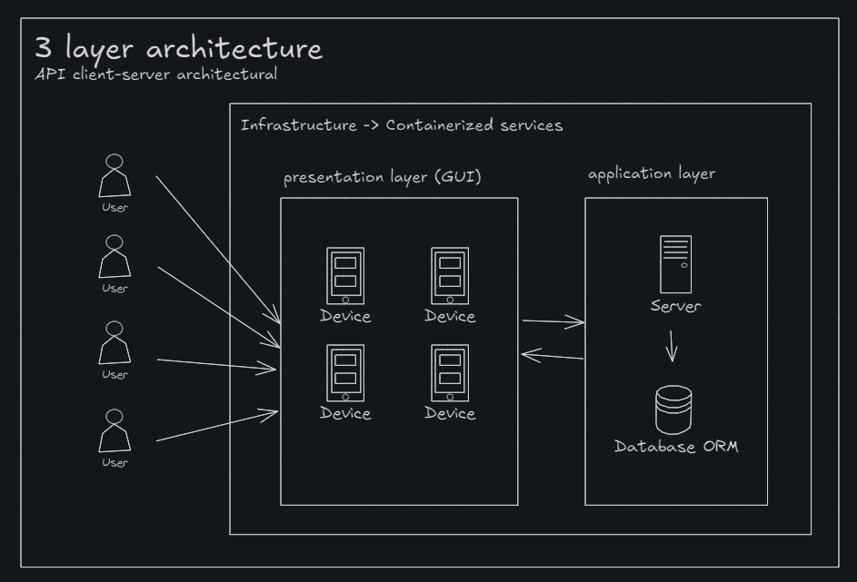
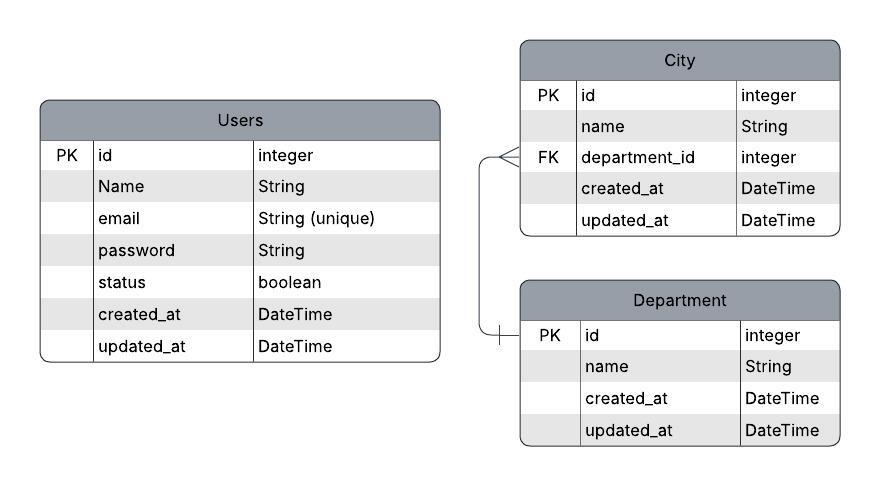

# Internacional de Electricos Practical Technical Interview

# Detalles del proyecto

Los requerimientos estan detallados aqui. [Click aqui para acceder al archivo de los requerimientos](REQUIREMENTS.md)

Monorepo con dos aplicaciones:



- /app -> Server/Backend/API REST -> (NestJs + Express + Prisma) -> [http://localhost:4000](http://localhost:4000)
- /client -> Client/UI/Frontend -> (Next.js + React + Tailwind + NextAuth) -> [http://localhost:3000](http://localhost:3000)
- Docs -> (Swagger) -> [http://localhost:8000](http://localhost:8000/api)
- /infra -> Deployment -> (Docker Compose)
  - [server + docker -&gt; http://localhost:2538 -&gt; http://localhost:4000](http://localhost:2538)
  - [client + docker -&gt; http://localhost:2539 -&gt; http://localhost:3000](http://localhost:2539)
  - [server + swagger + docker -&gt; http://localhost:2538/api -&gt; http://localhost:8000/api](http://localhost:2538/api)


# Requerimientos

Tenemos dos maneras de levantar los servicios:

1. Con las tecnologias individuales. necesitas descargar node con nvm/executable y postgres 
2. Usando docker para evitar instalar las tecnologias individualmente.

# ERD



# Variables de entorno

Como se levanta con docker, el archivo [.env.template](/infra/.env.template) contiene las variables de entorno necesarias para 

# Como usar?

1. Crea un usuario en  `http://localhost:2538/auth/register`. No se le coloco middleware para evitar dejar un seed de un usuario
  1.1 Usa swagger para crear el usuario accediendo al URI `http://localhost:2538/api`. alli vas a colocar en el body los datos de name, email y password. Ejemplo: 
```json
{
  "name": "Deissy Cortez",
  "email": "deissy@deissy.com",
  "password": "123456"
}
```
2. Logearse en el sistema en `http://localhost:2539`
3. Hacer uso del CRUD de departamentos y ciudades

# Ejecutar con Docker Compose

Se usa compose cuando se trabajan mas de un servicio para mejor escalabilidad y control sobre los diferentes servicios (Server o Client).

```bash
docker compose -f infra/docker-compose.yml up --build -d

```

Verificar el estado de los contenedores y su correcto funcionamiento:

```bash
docker ps
docker logs ie-api     # para verificar el log del servidor
docker logs ie-client  # para verificar el log del cliente
```
